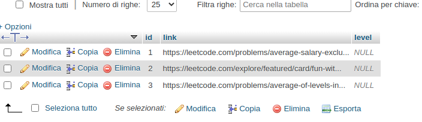
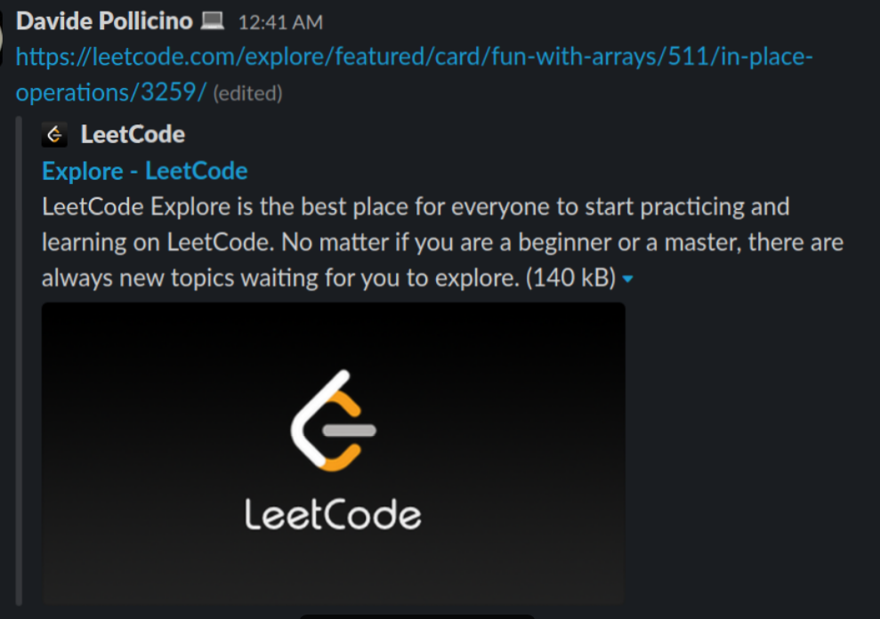

# slack_coding_challenge
Slack bot Designed to daily send a link to a coding challenge.

## Functionalities
This bot will automatically send a message to your slack channel. 
It is able to fetch a random link of a coding challenge from a file, or, from a mysql database (which I am currently using).

The structure of my challenges table is the following

## Bot Message structure

## Inspired from 
[https://medium.com/@sharan.aadarsh/sending-notification-to-slack-using-python-8b71d4f622f3](https://medium.com/@sharan.aadarsh/sending-notification-to-slack-using-python-8b71d4f622f3)
## System requirements
* Python3
## How to avoid to get this script running h24
I have set up a cronjob, to automatically trigger and run the python script, in according to my needs
[Guide to crontab job set-up](https://www.digitalocean.com/community/tutorials/how-to-use-cron-to-automate-tasks-ubuntu-1804)

## Troubleshoot:
https://stackoverflow.com/questions/8727935/execute-python-script-via-crontab#8727991
## Note
* At the root folder of the bot, make sure to add create a log folder; 
* This bot has been made during a boring thursday night, any feedback is welcome. 
